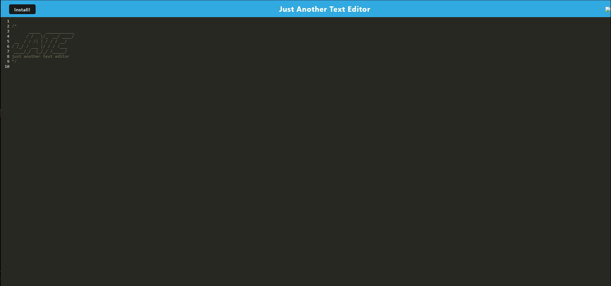

# Text Editor PWA

A simple text editor Progressive Web Application (PWA) that allows users to create notes or code snippets with or without an internet connection. The application saves the content using IndexedDB, so users can reliably retrieve their notes or snippets later.

## Features

- Single-page application that meets PWA criteria
- IndexedDB for data persistence
- Works offline
- Automatically saves content inside the text editor when the DOM window is unfocused
- Can be installed as a PWA on supported devices
- Uses webpack for bundling JavaScript files
- Registered service worker using workbox
- Static assets pre-cached upon loading

## Live Demo

[Text Editor PWA on Heroku](https://text-editor-pwa.herokuapp.com/)

## Getting Started

### Prerequisites

- [Node.js](https://nodejs.org/en/download/)

### Installation

1. Clone the repo:

git clone `https://github.com/Ishaval/Challenge-19.git`

2. Install NPM packages:

npm install

3. Run the application:

- npm run build

- npm run start:dev

4. Open your browser and navigate to `http://localhost:3000`

## Deployment

Follow the [Heroku Deployment Guide](https://www.theodinproject.com/paths/full-stack-javascript/courses/nodejs/lessons/deploying-to-heroku) to deploy this application to Heroku.

## License

This project is licensed under the MIT License.

## Acknowledgments

- [idb](https://github.com/jakearchibald/idb) - A lightweight wrapper around the IndexedDB API
- [Workbox](https://developers.google.com/web/tools/workbox) - A set of libraries for building PWAs
